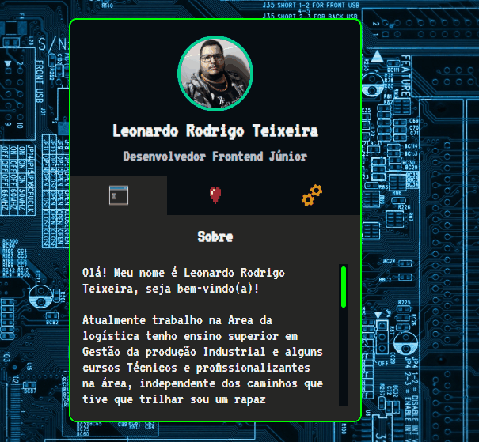

# Projeto MINI-PORTFÓLIO
Um Projeto com a intenção de criar um mini-Portfólio de DEV aplicando todas minha habilidades básicas adquiridas durante o curso "DEV Quest". 🚀

## Tecnologias utilizadas
- HTML
- CSS
- JS
